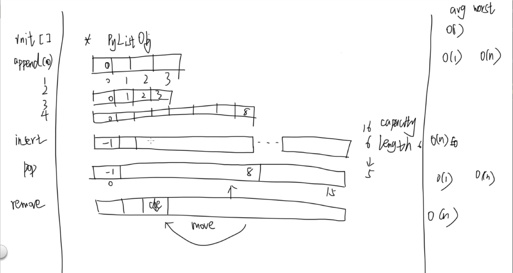

# 线性结构
本节我们从最简单和常用的线性结构开始，并结合 Python 语言本身内置的数据结构和其底层实现方式来讲解。
虽然本质上数据结构的思想是语言无关的，但是了解 Python 的实现方式有助于你避免一些坑。

我们会在代码中注释出操作的时间复杂度。

# 数组 array

数组是最常用到的一种线性结构，其实 python 内置了一个 array 模块，但是大部人甚至从来没用过它。
Python 的 array 是内存连续、存储的都是同一数据类型的结构，而且只能存数值和字符。

array 的文档：https://docs.python.org/2/library/array.html

推荐用 numpy.array)

本章最后用 list 来实现一个固定长度、并且支持所有 Python 数据类型的数组 Array.

# 列表 list
如果你学过 C++，list 其实和 C++ STL（标准模板库）中的 vector 很类似，它可能是你的 Python 学习中使用最频繁的数据结构之一。
这里我们不再去自己实现 list，因为这是个 Python 提供的非常基础的数据类型，我会在视频中讲解它的工作方式和内存分配策略，
避免使用过程中碰到一些坑。当然如果你有毅力或者兴趣的了解底层是如何实现的，可以看看 cpython 解释器的具体实现。
[O(1)](http://gongsichuang.com/news/post/TygxKeS7gOS5iOaEj+aAnQ==.html#:~:text=O%20%281%29%E6%98%AF%E6%9C%80%E4%BD%8E%E7%9A%84%E6%97%B6%E7%A9%BA%E5%A4%8D%E6%9D%82%E5%BA%A6%EF%BC%8C%E4%B9%9F%E5%B0%B1%E6%98%AF%E8%80%97%E6%97%B6%2F%E8%80%97%E7%A9%BA%E9%97%B4%E4%B8%8E%E8%BE%93%E5%85%A5%E6%95%B0%E6%8D%AE%E5%A4%A7%E5%B0%8F%E6%97%A0%E5%85%B3%EF%BC%8C%E6%97%A0%E8%AE%BA%E8%BE%93%E5%85%A5%E6%95%B0%E6%8D%AE%E5%A2%9E%E5%A4%A7%E5%A4%9A%E5%B0%91%E5%80%8D%EF%BC%8C%E8%80%97%E6%97%B6%2F%E8%80%97%E7%A9%BA%E9%97%B4%E9%83%BD%E4%B8%8D%E5%8F%98%E3%80%82,%E5%93%88%E5%B8%8C%E7%AE%97%E6%B3%95%E5%B0%B1%E6%98%AF%E5%85%B8%E5%9E%8B%E7%9A%84O%20%281%29%E6%97%B6%E9%97%B4%E5%A4%8D%E6%9D%82%E5%BA%A6%EF%BC%8C%E6%97%A0%E8%AE%BA%E6%95%B0%E6%8D%AE%E8%A7%84%E6%A8%A1%E5%A4%9A%E5%A4%A7%EF%BC%8C%E9%83%BD%E5%8F%AF%E4%BB%A5%E5%9C%A8%E4%B8%80%E6%AC%A1%E8%AE%A1%E7%AE%97%E5%90%8E%E6%89%BE%E5%88%B0%E7%9B%AE%E6%A0%87%EF%BC%88%E4%B8%8D%E8%80%83%E8%99%91%E5%86%B2%E7%AA%81%E7%9A%84%E8%AF%9D%EF%BC%89%E3%80%82)

操作                                  | 平均时间复杂度 |
--------------------------------------|----------------|
list[index]                           | O(1)           |
list.append                           | O(1)           |
list.insert                           | O(n)           |
list.pop(index), default last element | O(1)           |
list.remove                           | O(n)           |

# 用 list 实现 Array ADT
讲完了 list 让我们来实现一个定长的数组 Array ADT，在其他一些语言中，内置的数组结构就是定长的。
这里我们会使用 list 作为 Array 的一个成员（代理）。具体请参考视频讲解和代码示例，后边我们会使用到这个 Array 类。

# 小问题
- 线性结构的查找，删除，访问一个元素的平均时间复杂度(简单地理解为一个操作需要的平均步骤)
- list 内存重新分配的时候为什么要有冗余？不会浪费空间吗？
- 当你频繁的pop list 的第一个元素的时候，会发生什么？如果需要频繁在两头增添元素，你知道更高效的数据结构吗？后边我们会讲到

# 延伸阅读

[Python list implementation](https://www.laurentluce.com/posts/python-list-implementation/)

[https://github.com/python/cpython/blob/master/Objects/listobject.c](https://github.com/python/cpython/blob/master/Objects/listobject.c)

# 勘误
视频里的 Array.clear 方法有误。应该是 `for i in range(len(self._items))`，已经在后续所有使用到 Array 的代码里修正
